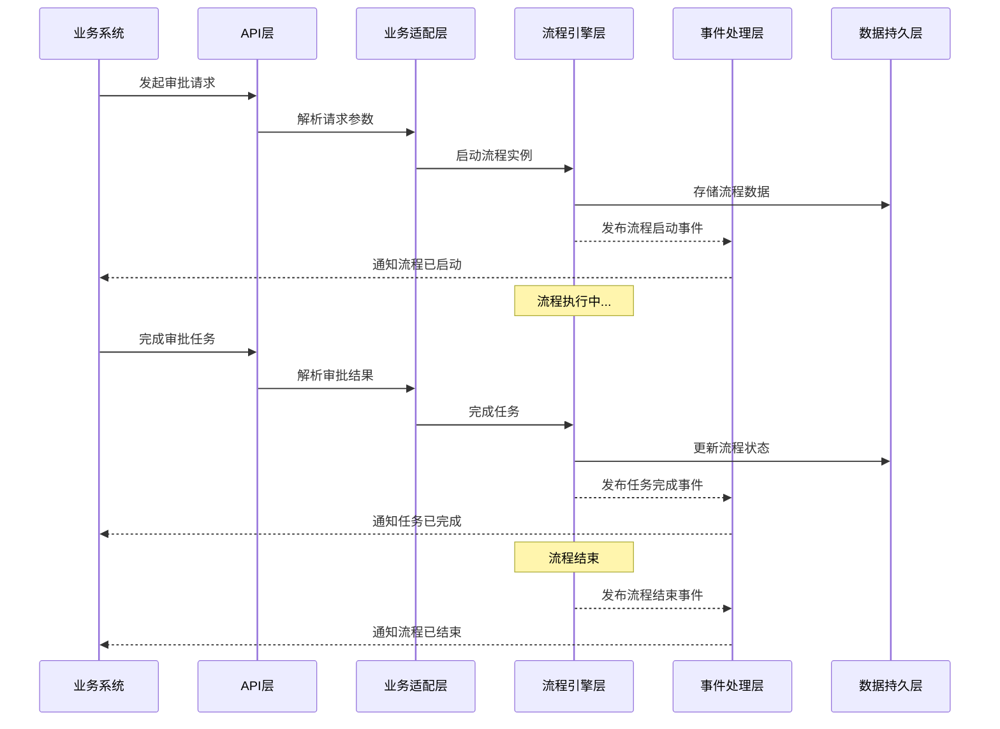

# 通用审批基础服务（Universal Approval Service）设计文档

## 1. 引言

### 1.1 文档目的

本文档旨在设计一个通用的审批基础服务（Universal Approval Service），作为企业级应用的基础服务组件，支持各种业务场景的流程审批和管理。该服务将提供统一的审批流程管理、模板配置、流程执行和事件通知能力，实现业务与流程的解耦，为企业数字化转型提供强大的流程引擎支持。

### 1.2 设计原则

- **模块化设计**：将审批服务划分为独立的功能模块，便于维护和扩展
- **事件驱动**：采用事件驱动架构，实现服务间的松耦合
- **可配置性**：支持通过配置模板定义审批流程，无需硬编码
- **可扩展性**：设计时考虑未来的扩展需求，如支持消息队列、多租户等
- **可靠性**：确保审批流程的可靠性和数据一致性

## 2. 系统架构

### 2.1 架构分层

通用审批基础服务采用分层架构设计，确保各层职责清晰，便于维护和扩展：

| 层级     | 名称               | 职责                                                                                            | 技术栈               |
| ------ | ---------------- | --------------------------------------------------------------------------------------------- | ----------------- |
| 网关与接入层 | API Layer        | 对外提供统一的 RESTful API，供其他微服务调用（如发起审批、查询待办、完成任务、获取流转历史）                                          | Spring Boot Web   |
| 业务适配层  | Business Adapter | 负责“业务”与“流程”的解耦，包含模板配置中心、业务回调注册等功能                                                             | Spring Boot       |
| 流程引擎层  | Engine Layer     | 封装 Flowable 的原生 API（RepositoryService, RuntimeService, TaskService, HistoryService），处理核心的流转逻辑 | Flowable 7.0.0    |
| 模型设计层  | Designer Layer   | 集成 Flowable Modeler，提供前端可视化的 BPMN 2.0 流程绘制和部署能力                                               | Flowable Modeler  |
| 事件处理层  | Event Layer      | 管理事件发布和订阅，实现服务解耦                                                                              | Spring Event      |
| 数据持久层  | Data Layer       | 管理数据存储和访问                                                                                     | MyBatis-Plus + H2 |

### 2.2 核心流程图



## 3. 核心功能模块

### 3.1 流程模板管理

#### 3.1.1 模板配置

- **模板定义**：通过 JSON 模板定义审批流程，支持节点、连线、条件等配置
- **模板版本**：支持模板版本管理，确保流程变更的可追溯性
- **模板部署**：将 JSON 模板转换为 BPMN 2.0 格式并部署到 Flowable 引擎

#### 3.1.3 JSON 模板规范

```json
{
  "templateCode": "PURCHASE_001",
  "templateName": "通用采购审批流",
  "version": 1,
  "globalConfigs": {
    "autoResetVarsOnReject": ["is_urgent", "audit_remark"],
    "dataSource": "springBean:flowTools"
  },
  "nodes": [
    {
      "id": "startNode",
      "type": "start",
      "next": "managerTask"
    },
    {
      "id": "managerTask",
      "name": "主管审批",
      "type": "userTask",
      "assignee": "${deptManager}",
      "allowReject": true,
      "rejectTo": "startNode",
      "next": "amountGateway"
    },
    {
      "id": "amountGateway",
      "name": "金额判定",
      "type": "exclusiveGateway",
      "conditions": [
        {
          "expression": "${flowTools.getAmount(execution) > 5000}",
          "next": "directorTask"
        },
        {
          "expression": "${flowTools.getAmount(execution) <= 5000}",
          "next": "endNode"
        }
      ]
    },
    {
      "id": "directorTask",
      "name": "总监审批",
      "type": "userTask",
      "assignee": "ROLE_DIRECTOR",
      "next": "endNode"
    },
    {
      "id": "endNode",
      "type": "end"
    }
  ]
}
```

### 3.2 流程执行管理

#### 3.2.1 流程启动

- **参数处理**：接收业务系统传入的模板编码、业务主键和变量
- **流程实例创建**：根据模板创建流程实例，并设置初始变量
- **事件发布**：发布流程启动事件，通知相关系统

#### 3.2.2 任务管理

- **待办任务查询**：根据用户 ID 查询待办任务列表
- **任务完成**：处理审批结果，更新任务状态
- **任务委派**：支持任务委派给其他用户

#### 3.2.3 流程监控

- **流程状态查询**：查询流程实例的当前状态
- **审批历史查询**：获取流程的审批历史记录
- **流程统计**：提供流程执行的统计数据

### 3.3 事件驱动机制

#### 3.3.1 统一事件模型

- **事件类型**：定义标准的审批事件类型，如流程启动、任务创建、任务完成、流程结束、审批回退等
- **事件载荷**：统一事件载荷结构，包含模板编码、业务主键、流程实例 ID、审批结果等信息

#### 3.3.2 Flowable 与 Spring Event 的桥接
- **全局审批结束监听器**：配置在 Flowable 的结束节点或全局流程属性上
- **事件发布**：监听器被触发时，收集当前流程的 businessKey 和状态，通过 Spring 的 ApplicationEventPublisher 发布事件

#### 3.3.3 业务消费端解耦

- **路由分发机制**：订阅者接收到事件后，根据 templateCode 将逻辑路由到对应的业务处理类
- **无缝衔接业务线**：例如，当监听到 templateCode = 'MALL\_ORDER\_APPROVAL' 且结果为 PASS 时，订阅者触发后续的“订单流转 -> 物流下发 -> 对账结算”等一系列业务动作

#### 3.3.4 为未来替换 MQ 做好扩展准备

- **抽象发布接口**：定义一个 ApprovalMessagePublisher 接口，屏蔽底层实现细节
- **当前阶段的 Spring Event 实现**：提供一个基于 Spring ApplicationEventPublisher 的实现类
- **未来的 MQ 实现**：当系统规模扩大时，只需新增一个基于 Kafka 或 RabbitMQ 的实现类

### 3.4 复杂场景处理

#### 3.4.1 回退逻辑

- **退回上一步**：将流程回退到上一个审批节点
- **退回发起人**：将流程直接回退到发起人
- **退回指定节点**：将流程回退到指定的审批节点
- **变量重置**：回退时自动清空或重置指定的业务变量
- **命令模式回退**：使用 Command 模式实现跳转，并在跳转逻辑中加入变量清理

#### 3.4.2 会签处理

- **并行会签**：支持多人并行审批
- **串行会签**：支持多人串行审批
- **会签策略**：支持一人驳回全部退回等会签策略
- **会签补偿**：会签驳回后自动执行补偿逻辑
- **会签监听器**：通过 ExecutionListener 监听会签任务完成事件，实现一人驳回全部退回的逻辑

#### 3.4.3 动态变量

- **基于 JavaDelegate 的"拉取式"动态获取**：在流程流转到需要判断条件的排他网关之前，先放置一个隐藏的 Service Task，通过 Spring Event 发送同步的"数据请求事件"给业务模块
- **利用 Flowable 表达式中的 Spring Bean 动态注入**：在分支条件中使用 ${bean.method() > 5000} 形式的表达式
- **基于"变量映射模板"的自动化隔离**：在 JSON 模板配置中，增加 variable\_mapping 配置项，定义变量的来源和获取方式

#### 3.4.4 自动补偿逻辑

- **流程内补偿**：利用 BPMN 的取消事件或特定的 Service Task
- **业务外补偿**：通过发布一个"审批否决"的 Spring Event，由各业务订阅者自行处理补偿逻辑
- **补偿轨迹记录**：在 H2 中增加 biz\_compensation\_log 表，记录补偿动作的执行情况

## 4. 数据库设计

### 4.1 数据库架构

通用审批基础服务使用 H2 数据库作为存储，分为两类表：

#### 4.1.1 Flowable 原生表

- **ACT\_RE\_**\*：存储流程定义和静态资源
- **ACT\_RU\_**\*：存储运行时数据（正在运行的流程实例、任务）
- **ACT\_HI\_**\*：存储历史数据（已结束的流程和审计轨迹）

#### 4.1.2 业务扩展表

- **biz\_approval\_template**：审批模板配置表
- **biz\_approval\_log**：审批流水日志表
- **biz\_event\_message**：本地消息表，用于事件可靠性保障
- **biz\_compensation\_log**：补偿轨迹记录表，记录补偿动作的执行情况

### 4.2 核心表结构

#### 4.2.1 审批模板表 (biz\_approval\_template)

| 字段名                      | 数据类型         | 描述       |
| ------------------------ | ------------ | -------- |
| id                       | BIGINT       | 主键       |
| template\_code           | VARCHAR(50)  | 模板编码     |
| template\_name           | VARCHAR(100) | 模板名称     |
| version                  | INT          | 版本号      |
| config\_json             | TEXT         | JSON 配置  |
| process\_definition\_key | VARCHAR(100) | 流程定义 key |
| deployment\_id           | VARCHAR(100) | 部署 ID    |
| status                   | VARCHAR(20)  | 状态       |
| create\_time             | TIMESTAMP    | 创建时间     |
| update\_time             | TIMESTAMP    | 更新时间     |

#### 4.2.2 审批日志表 (biz\_approval\_log)

| 字段名                   | 数据类型         | 描述      |
| --------------------- | ------------ | ------- |
| id                    | BIGINT       | 主键      |
| template\_code        | VARCHAR(50)  | 模板编码    |
| business\_key         | VARCHAR(100) | 业务主键    |
| process\_instance\_id | VARCHAR(100) | 流程实例 ID |
| task\_id              | VARCHAR(100) | 任务 ID   |
| operation             | VARCHAR(20)  | 操作类型    |
| operator              | VARCHAR(50)  | 操作人     |
| comments              | TEXT         | 审批意见    |
| status                | VARCHAR(20)  | 审批状态    |
| create\_time          | TIMESTAMP    | 创建时间    |

#### 4.2.3 本地消息表 (biz\_event\_message)

| 字段名                   | 数据类型         | 描述                          |
| --------------------- | ------------ | --------------------------- |
| id                    | BIGINT       | 主键                          |
| event\_type           | VARCHAR(50)  | 事件类型                        |
| business\_key         | VARCHAR(100) | 业务主键                        |
| process\_instance\_id | VARCHAR(100) | 流程实例 ID                     |
| event\_data           | TEXT         | 事件数据                        |
| status                | VARCHAR(20)  | 状态 (PENDING/SUCCESS/FAILED) |
| retry\_count          | INT          | 重试次数                        |
| create\_time          | TIMESTAMP    | 创建时间                        |
| update\_time          | TIMESTAMP    | 更新时间                        |

#### 4.2.4 补偿轨迹记录表 (biz\_compensation\_log)

| 字段名                   | 数据类型         | 描述                    |
| --------------------- | ------------ | --------------------- |
| id                    | BIGINT       | 主键                    |
| process\_instance\_id | VARCHAR(100) | 流程实例 ID               |
| business\_key         | VARCHAR(100) | 业务主键                  |
| compensation\_topic   | VARCHAR(100) | 补偿动作主题                |
| compensation\_params  | TEXT         | 补偿参数                  |
| status                | VARCHAR(20)  | 补偿状态 (SUCCESS/FAILED) |
| error\_message        | TEXT         | 错误信息                  |
| create\_time          | TIMESTAMP    | 创建时间                  |
| update\_time          | TIMESTAMP    | 更新时间                  |

## 5. API 设计

### 5.1 模板管理 API

| API 路径                               | 方法     | 功能描述   | 请求体       | 响应体  |
| ------------------------------------ | ------ | ------ | --------- | ---- |
| /api/approval/template               | POST   | 创建审批模板 | JSON 模板配置 | 模板信息 |
| /api/approval/template/{code}        | GET    | 获取模板详情 | N/A       | 模板信息 |
| /api/approval/template/{code}        | PUT    | 更新模板   | JSON 模板配置 | 模板信息 |
| /api/approval/template/{code}        | DELETE | 删除模板   | N/A       | 操作结果 |
| /api/approval/template/{code}/deploy | POST   | 部署模板   | N/A       | 部署结果 |

### 5.2 流程管理 API

| API 路径                               | 方法     | 功能描述   | 请求体          | 响应体    |
| ------------------------------------ | ------ | ------ | ------------ | ------ |
| /api/approval/process                | POST   | 启动流程   | 模板编码、业务主键、变量 | 流程实例信息 |
| /api/approval/process/{id}           | GET    | 获取流程详情 | N/A          | 流程实例信息 |
| /api/approval/process/{id}           | DELETE | 终止流程   | N/A          | 操作结果   |
| /api/approval/process/{id}/variables | GET    | 获取流程变量 | N/A          | 变量列表   |
| /api/approval/process/{id}/variables | PUT    | 更新流程变量 | 变量键值对        | 操作结果   |

### 5.3 任务管理 API

| API 路径                           | 方法   | 功能描述     | 请求体     | 响应体  |
| -------------------------------- | ---- | -------- | ------- | ---- |
| /api/approval/task               | GET  | 获取待办任务列表 | N/A     | 任务列表 |
| /api/approval/task/{id}          | GET  | 获取任务详情   | N/A     | 任务详情 |
| /api/approval/task/{id}          | POST | 完成任务     | 审批结果、意见 | 操作结果 |
| /api/approval/task/{id}/delegate | POST | 委派任务     | 被委派人    | 操作结果 |
| /api/approval/task/{id}/rollback | POST | 回退任务     | 回退目标节点  | 操作结果 |

### 5.4 历史查询 API

| API 路径                        | 方法  | 功能描述   | 请求体     | 响应体  |
| ----------------------------- | --- | ------ | ------- | ---- |
| /api/approval/history/process | GET | 查询流程历史 | 流程实例 ID | 流程历史 |
| /api/approval/history/task    | GET | 查询任务历史 | 流程实例 ID | 任务历史 |
| /api/approval/history/log     | GET | 查询审批日志 | 业务主键    | 审批日志 |

## 6. 技术实现

### 6.1 核心组件

#### 6.1.1 模板转换服务

```java
@Service
public class BpmnGeneratorService {
    public BpmnModel convertToBpmnModel(JsonTemplate template) {
        BpmnModel model = new BpmnModel();
        org.flowable.bpmn.model.Process process = new org.flowable.bpmn.model.Process();
        process.setId(template.getTemplateCode());
        process.setName(template.getTemplateName());
        model.addProcess(process);

        // 1. 第一遍遍历：创建所有基础节点
        for (NodeConfig node : template.getNodes()) {
            org.flowable.bpmn.model.FlowElement element = createFlowElement(node);
            process.addFlowElement(element);
        }

        // 2. 第二遍遍历：构建连线 (SequenceFlow)
        for (NodeConfig node : template.getNodes()) {
            if (node.getNext() != null) {
                // 普通连线
                process.addFlowElement(new org.flowable.bpmn.model.SequenceFlow(node.getId(), node.getNext()));
            } else if (node.getConditions() != null) {
                // 网关分支连线
                for (ConditionConfig cond : node.getConditions()) {
                    org.flowable.bpmn.model.SequenceFlow flow = new org.flowable.bpmn.model.SequenceFlow(node.getId(), cond.getNext());
                    // 注入动态变量表达式
                    flow.setConditionExpression(cond.getExpression());
                    process.addFlowElement(flow);
                }
            }
        }

        // 3. 关键：自动计算节点坐标
        new org.flowable.bpmn.model.BpmnAutoLayout(model).execute();
        return model;
    }

    private org.flowable.bpmn.model.FlowElement createFlowElement(NodeConfig config) {
        switch (config.getType()) {
            case "start":
                return new org.flowable.bpmn.model.StartEvent() {{ setId(config.getId()); }};
            case "end":
                return new org.flowable.bpmn.model.EndEvent() {{ setId(config.getId()); }};
            case "userTask":
                org.flowable.bpmn.model.UserTask task = new org.flowable.bpmn.model.UserTask();
                task.setId(config.getId());
                task.setName(config.getName());
                task.setAssignee(config.getAssignee());
                return task;
            case "exclusiveGateway":
                org.flowable.bpmn.model.ExclusiveGateway gateway = new org.flowable.bpmn.model.ExclusiveGateway();
                gateway.setId(config.getId());
                gateway.setName(config.getName());
                return gateway;
            default:
                throw new IllegalArgumentException("Unknown node type: " + config.getType());
        }
    }
}
```

#### 6.1.2 事件总线服务

```java
@Configuration
public class SpringEventConfig {
    @Bean
    public ApprovalMessagePublisher approvalMessagePublisher(ApplicationEventPublisher eventPublisher) {
        return new SpringApprovalMessagePublisher(eventPublisher);
    }
}

public interface ApprovalMessagePublisher {
    void publish(ApprovalEvent event);
}

public class SpringApprovalMessagePublisher implements ApprovalMessagePublisher {
    private final ApplicationEventPublisher eventPublisher;

    public SpringApprovalMessagePublisher(ApplicationEventPublisher eventPublisher) {
        this.eventPublisher = eventPublisher;
    }

    @Override
    public void publish(ApprovalEvent event) {
        eventPublisher.publishEvent(event);
    }
}

// 事件监听器示例
@Component
public class ApprovalEventListener {
    @EventListener
    public void onApprovalCompleted(ApprovalCompletedEvent event) {
        // 处理审批完成事件
        System.out.println("Approval completed for business key: " + event.getBusinessKey());
    }

    @EventListener
    public void onApprovalRollback(ApprovalRollbackEvent event) {
        // 处理审批回退事件
        System.out.println("Approval rolled back for business key: " + event.getBusinessKey());
    }
}
```

#### 6.1.3 回退命令

```java
public class JumpToNodeCommand implements Command<Void> {
    private String taskId;
    private String targetNodeKey;
    private List<String> cleanVars;

    public Void execute(CommandContext commandContext) {
        TaskEntity task = commandContext.getTaskEntityManager().findById(taskId);
        ExecutionEntity execution = task.getExecution();
        Process process = ProcessDefinitionUtil.getProcess(execution.getProcessDefinitionId());

        // 1. 获取目标节点对象
        FlowElement targetElement = process.getFlowElement(targetNodeKey);

        // 2. 变量清理：实现"回退后自动清空"
        if (cleanVars != null) {
            for (String var : cleanVars) {
                execution.setVariable(var, null);
            }
        }

        // 3. 执行核心跳转：修改当前执行流的指向
        execution.setCurrentFlowElement(targetElement);
        
        // 4. 驱动引擎产生新任务（删除当前任务，创建目标任务）
        commandContext.getTaskEntityManager().deleteTask(task, "jump_rollback", false);
        
        // 5. 抛出 Spring 事件：让业务侧感知回退动作
        // injector.getInstance(EventBus.class).post(new ApprovalRollbackEvent(...));

        return null;
    }
}
```

#### 6.1.4 会签处理命令

```java
public class MultiInstanceJumpCommand implements Command<Void> {
    private String processInstanceId;
    private String targetNodeKey;

    public Void execute(CommandContext commandContext) {
        ExecutionEntityManager executionEntityManager = commandContext.getExecutionEntityManager();
        
        // 1. 获取该流程实例下所有的执行流
        List<ExecutionEntity> executions = executionEntityManager.findChildExecutionsByProcessInstanceId(processInstanceId);
        
        // 2. 强制删除所有子执行流（即清理所有会签实例）
        for (ExecutionEntity exec : executions) {
            executionEntityManager.deleteExecutionAndRelatedData(exec, "MultiInstance_Reject", false);
        }

        // 3. 将主执行流（Root Execution）跳转至目标节点
        ExecutionEntity rootExecution = executionEntityManager.findById(processInstanceId);
        Process process = ProcessDefinitionUtil.getProcess(rootExecution.getProcessDefinitionId());
        FlowElement targetElement = process.getFlowElement(targetNodeKey);
        
        rootExecution.setCurrentFlowElement(targetElement);
        // 触发引擎进入新节点
        commandContext.getAgenda().planContinueProcessOperation(rootExecution);
        
        return null;
    }
}
```

#### 6.1.5 会签监听器

```java
public class MultiInstanceRejectListener implements TaskListener {
    @Inject
    private ApplicationEventPublisher eventPublisher; // Spring 事件发布器

    @Override
    public void notify(org.flowable.engine.delegate.DelegateTask delegateTask) {
        String result = (String) delegateTask.getVariable("approve_result");
        
        if ("REJECT".equals(result)) {
            // 1. 发送 Spring 内部事件，记录驳回日志
            eventPublisher.publishEvent(new MultiInstanceRejectEvent(delegateTask.getProcessInstanceId()));
            
            // 2. 这里的核心逻辑是：抛出一个特定的 BpmnError 或者 
            // 直接由 Service 层调用 JumpCommand 执行强制跳转
        }
    }
}
```

#### 6.1.6 补偿命令

```java
public class MultiInstanceRejectWithCompensationCommand implements org.flowable.engine.impl.interceptor.Command<Void> {
    private String taskId;
    private ApplicationEventPublisher eventPublisher;

    public MultiInstanceRejectWithCompensationCommand(String taskId, ApplicationEventPublisher eventPublisher) {
        this.taskId = taskId;
        this.eventPublisher = eventPublisher;
    }

    public Void execute(org.flowable.engine.impl.interceptor.CommandContext commandContext) {
        // 1. 获取任务和流程上下文
        org.flowable.task.service.impl.persistence.entity.TaskEntity task = commandContext.getTaskService().findById(taskId);
        String processInstanceId = task.getProcessInstanceId();
        
        // 2. 解析 JSON 模板中的补偿配置 (从我们的配置表中读)
        CompensationConfig config = templateService.getCompensationByTaskId(taskId);

        // 3. 执行强制跳转 (清理所有并行的会签实例)
        new MultiInstanceJumpCommand(processInstanceId, "startNode").execute(commandContext);

        // 4. 发送 Spring 补偿事件
        // 这里是核心：通过 ApplicationEventPublisher 发布补偿信号
        eventPublisher.publishEvent(new AutoCompensationEvent(
            processInstanceId, 
            config.getTopic(), 
            config.getParams()
        ));

        return null;
    }
}
```

### 6.2 技术栈

| 技术               | 版本      | 用途     | 备注                                               |
| ---------------- | ------- | ------ | ------------------------------------------------ |
| Spring Boot      | 3.4.0   | 应用框架   | 使用 Jakarta EE 命名空间                               |
| Flowable         | 7.1.0   | 流程引擎   | 原生适配 Spring Boot 3                               |
| Flowable Modeler | 7.1.0   | 流程设计器  | 集成到 Spring Boot 应用中                              |
| MyBatis-Plus     | 3.5.7   | ORM 框架 | 与 Spring Boot 3.4.0 兼容性良好                        |
| H2               | 2.2.224 | 内存数据库  | 使用 File Mode，需配置兼容性参数                            |
| Spring Event     | 内置      | 事件总线   | 与 Spring 生态完美集成,可以通过一行配置轻松对接 Spring Cloud Stream |
| Lombok           | 1.18.30 | 代码简化   | 无兼容性问题                                           |
| JDK              | 17      | 运行环境   | 确保 Flowable 7.1.0 运行稳定                           |

## 7. 部署与集成

### 7.1 部署方式

- **独立部署**：作为独立的微服务部署
- **嵌入式部署**：嵌入到现有应用中
- **容器化部署**：使用 Docker 容器部署

### 7.2 集成方式

- **REST API**：通过 RESTful API 与业务系统集成
- **事件驱动**：通过 Spring Event 与业务系统集成
- **未来扩展**：支持通过消息队列与业务系统集成，结合 Spring Cloud Stream

### 7.3 配置管理

- **数据库配置**：H2 数据库配置，需设置兼容性参数
  ```yaml
  spring:
    datasource:
      url: jdbc:h2:file:./db/approval_db;MODE=PostgreSQL;DATABASE_TO_LOWER=TRUE;DEFAULT_NULL_ORDERING=HIGH;NON_KEYWORDS=USER,VALUE
      driver-class-name: org.h2.Driver
  ```
- **Flowable 配置**：流程引擎配置
- **事件总线配置**：Spring Event 配置
- **API 配置**：REST API 配置

## 8. 监控与运维

### 8.1 监控指标

- **流程执行指标**：流程启动数、完成数、平均执行时间
- **任务指标**：任务创建数、完成数、平均处理时间
- **系统指标**：CPU 使用率、内存使用率、数据库连接数

### 8.2 日志管理

- **业务日志**：审批操作日志
- **系统日志**：应用运行日志
- **审计日志**：安全审计日志

### 8.3 故障处理

- **异常处理**：统一的异常处理机制
- **错误重试**：事件处理失败的重试机制
- **故障恢复**：系统故障后的恢复机制

## 9. 安全性

### 9.1 认证与授权

- **用户认证**：集成企业认证系统
- **权限控制**：基于角色的访问控制
- **API 安全**：API 访问控制和限流

### 9.2 数据安全

- **数据加密**：敏感数据加密存储
- **数据脱敏**：API 响应数据脱敏
- **访问控制**：数据访问权限控制

## 10. 未来扩展

### 10.1 功能扩展

- **多租户支持**：支持多租户隔离
- **流程版本管理**：支持流程版本的并行运行
- **高级分析**：流程执行数据分析和报表

### 10.2 技术扩展

- **消息队列集成**：替换 Spring Event 为消息队列
- **分布式部署**：支持多实例部署
- **容器编排**：支持 Kubernetes 部署

### 10.3 集成扩展

- **第三方系统集成**：与 ERP、CRM 等系统集成
- **移动审批**：支持移动设备审批
- **智能审批**：基于 AI 的智能审批建议

## 11. 结论

通用审批基础服务（Universal Approval Service）是一个基于 Spring Boot、Flowable、MyBatis-Plus、H2 和 Spring Event 的企业级审批服务框架。它通过模块化设计、事件驱动架构和可配置性，为企业提供了一个灵活、可靠、可扩展的审批流程管理解决方案。

该服务不仅支持简单的线性审批，还支持复杂的分支、回退和会签等场景，满足企业多样化的审批需求。同时，通过事件驱动架构，实现了与业务系统的解耦，为未来的系统演进和扩展奠定了基础。

本设计方案特别强调了以下核心优势：

1. **元数据驱动**：通过 JSON 模板定义审批流程，降低业务配置的门槛，同时支持 Flowable Modeler 线上配置。
2. **事件驱动**：采用 Spring Event 实现服务间的解耦，同时为未来切换到消息队列（如 Kafka 或 RabbitMQ）做好了扩展准备。
3. **复杂场景处理**：支持三种回退方式（退回上一步、退回发起人、退回指定节点）、会签处理（一人驳回全部退回）和自动补偿逻辑。
4. **动态变量**：通过三种方式实现变量的动态获取，确保流程执行时数据的准确性和实时性。
5. **可靠性保障**：通过本地消息表和补偿轨迹记录表，确保事件处理的可靠性和可追溯性。
6. **技术栈选择**：使用 H2 的 File Mode 确保数据持久化，结合 Spring Boot 3.2.0、Flowable 7.0.0 和 Spring Event，构建了一个轻量但功能强大的审批服务，确保版本兼容性和稳定性。
7. **H2 兼容性处理**：通过配置 H2 数据库的兼容性参数，解决了 Flowable 7.0.0 与 H2 2.x 版本的兼容性问题，确保系统稳定运行。

通过本文档的设计，通用审批基础服务将成为企业数字化转型的重要基础设施，为企业的流程管理和业务自动化提供强大支持。无论企业规模大小，都可以基于此设计构建适合自己业务场景的审批系统，并随着业务的发展进行灵活扩展。
